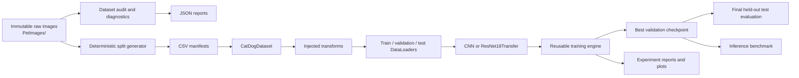
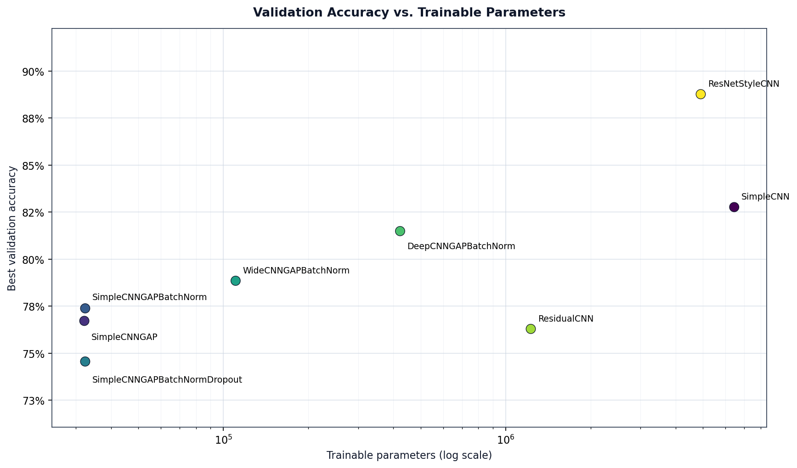
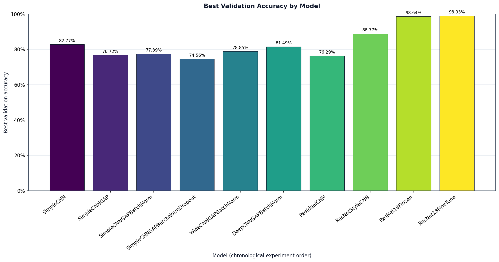

# Cat-Dog Image Classification

An end-to-end PyTorch computer vision case study for binary image classification on the Microsoft/Kaggle Cats vs Dogs dataset. The repository follows the full experimental lifecycle: data auditing, deterministic split generation, manifest-backed loading, train-only normalization, controlled architecture experiments, transfer learning, held-out test evaluation, and GPU inference benchmarking.

The project was built to answer two practical questions:

1. How do common CNN design choices affect accuracy, parameter count, and runtime under a controlled training setup?
2. How much does ImageNet transfer learning improve this task compared with models trained from scratch?

## Portfolio Highlights

| Area | Result |
|---|---|
| Dataset | 24,998 audited images with balanced Cat and Dog classes |
| Reproducibility | Deterministic stratified manifests generated with seed 42 |
| Experiment design | 10 controlled model runs using the same train/validation split |
| Selected model | Fine-tuned ImageNet-pretrained ResNet18 |
| Best validation accuracy | 98.9333% |
| Final held-out test accuracy | 98.5867% |
| Final test macro F1 | 0.985867 |
| Deployment analysis | GPU latency, throughput, memory, and checkpoint-size comparison |

## Contents

- [System Design](#system-design)
- [Dataset and Data Quality](#dataset-and-data-quality)
- [Data Pipeline](#data-pipeline)
- [Training and Evaluation Methodology](#training-and-evaluation-methodology)
- [Model Development](#model-development)
- [Final Selected Model](#final-selected-model)
- [Final Test Evaluation](#final-test-evaluation)
- [Inference Benchmark](#inference-benchmark)
- [Getting Started](#getting-started)
- [Reproducible Workflows](#reproducible-workflows)
- [Repository Structure](#repository-structure)
- [Limitations and Future Work](#limitations-and-future-work)
- [Key Takeaways](#key-takeaways)

## System Design



The design separates data identity, preprocessing, model definition, and optimization:

- CSV manifests are the source of truth for split membership.
- The dataset loads images but does not resize, normalize, augment, or split them.
- Transform builders own preprocessing and distinguish training from evaluation behavior.
- DataLoader builders connect manifests to the appropriate transform family.
- Models return raw logits; loss and optimization remain outside model classes.
- The training engine owns one training epoch and one validation epoch.
- High-level scripts define experiment configuration, checkpoint selection, and reporting.

This separation keeps experiments comparable and makes each layer independently reusable.

## Dataset and Data Quality

### Source and labels

The project uses the Microsoft/Kaggle Cats vs Dogs dataset with this local structure:

```text
PetImages/
|-- Cat/
`-- Dog/
```

| Class | Label | Images |
|---|---:|---:|
| Cat | 0 | 12,499 |
| Dog | 1 | 12,499 |
| **Total** |  | **24,998** |

The raw dataset is intentionally excluded from Git. Raw files remain immutable: scripts may read them, but do not delete, rename, move, resize, repair, overwrite, or automatically exclude them.

### Audit and diagnostics

The audit performs Pillow verification followed by a reopen and full pixel load. It records dataset-level counts, extensions, dimensions, and invalid paths in [dataset_audit.json](reports/dataset_audit.json).

The project also ranks small images and extreme aspect ratios for manual inspection without defining an arbitrary quality threshold. Candidate lists are stored in [dataset_outliers.json](reports/dataset_outliers.json), and optional contact sheets can be generated under the ignored `outputs/` directory.

A manifest-wide loading diagnostic reproduced the same deterministic evaluation path used by the project. It found one non-fatal warning:

```text
PetImages/Dog/9041.jpg
UserWarning: Truncated File Read
Split: train
```

The file remains in the training split. The raw image and manifests were not modified, and no sample was silently filtered.

The diagnostic evidence is stored in [image_loading_warnings.json](reports/image_loading_warnings.json).

### Reproducible splits

The split generator applies a deterministic per-class shuffle using `random.Random(42)`, followed by a largest-remainder allocation for the 70/15/15 ratios. Rows are written in stable project-relative path order.

| Split | Cat | Dog | Total | Share |
|---|---:|---:|---:|---:|
| Train | 8,749 | 8,749 | 17,498 | 70.00% |
| Validation | 1,875 | 1,875 | 3,750 | 15.00% |
| Test | 1,875 | 1,875 | 3,750 | 15.00% |

The generator validates that every image appears exactly once, no path overlaps between splits, all referenced files exist, and both classes remain balanced as closely as mathematically possible. Split metadata is recorded in [split_metadata.json](splits/split_metadata.json).

## Data Pipeline

### Manifest-backed dataset

[CatDogDataset](src/datasets/cat_dog_dataset.py) reads a CSV manifest once during initialization and lazily opens individual images in `__getitem__`. Every image is converted to RGB immediately.

Default output:

```python
image, label
```

Optional diagnostic output:

```python
image, label, metadata
```

Metadata contains the project-relative path, class name, original width, and original height. The loader validates required CSV columns, rejects paths that escape the repository root, and raises contextual errors for missing files or invalid manifest values.

### Preprocessing

Training and evaluation transformations are deliberately separate.

| Pipeline | Operations |
|---|---|
| Scratch training | Resize(256), RandomResizedCrop(224), RandomHorizontalFlip, ToTensor, Normalize |
| Scratch evaluation | Resize(256), CenterCrop(224), ToTensor, Normalize |
| ResNet18 training | Same spatial augmentation with ImageNet normalization |
| ResNet18 evaluation | Deterministic resize and center crop with ImageNet normalization |

Scratch-model normalization was calculated from the 17,498 training images only, after resizing each image to 224 × 224. The calculation metadata is stored in [train_normalization.json](reports/train_normalization.json):

```text
mean = [0.4873452324, 0.4544898525, 0.4166837849]
std  = [0.2603815151, 0.2535908669, 0.2564516297]
```

The ResNet18 transfer pipeline uses the normalization expected by ImageNet-pretrained weights:

```text
mean = [0.485, 0.456, 0.406]
std  = [0.229, 0.224, 0.225]
```

Validation and test images never contribute to learned preprocessing statistics.

### DataLoaders

The scratch and transfer-learning DataLoader builders both provide train, validation, and test loaders with configurable batch size, worker count, and pinned memory:

- Training uses `shuffle=True`.
- Validation and test use `shuffle=False`.
- CUDA experiments enable pinned memory.
- Multi-worker execution occurs only inside guarded entry points for Windows compatibility.

The transfer-learning loader reuses the same manifests and dataset implementation while injecting ImageNet-compatible transforms.

## Training and Evaluation Methodology

The reusable [training engine](src/training/engine.py) exposes:

- `train_one_epoch(...)` for forward pass, sample-weighted loss accumulation, backpropagation, and optimizer updates.
- `validate_one_epoch(...)` for deterministic evaluation under `torch.no_grad()`.

Both functions calculate accuracy from `logits.argmax(dim=1)`. Models return raw logits for `CrossEntropyLoss`; no model applies softmax internally.

### Controlled experiment protocol

Unless explicitly noted, experiments used:

| Setting | Value |
|---|---|
| Seed | 42 |
| Optimizer | Adam |
| Batch size | 32 |
| Epochs | 10 |
| Scratch/frozen learning rate | 0.001 |
| Fine-tuning learning rate | 0.0001 |
| Checkpoint selection | Highest validation accuracy |
| Input size | 3 × 224 × 224 |

Python, PyTorch CPU, and CUDA random states were seeded. All architectures used the same committed train and validation manifests. The test split was excluded from training, architecture comparison, and checkpoint selection.

Checkpoints store the completed epoch, model state, optimizer state, validation metrics, and experiment configuration. They are written under `checkpoints/`, which is ignored by Git because these binary artifacts are large and reproducible from source code plus manifests.

## Model Development

The sequence was designed as a controlled set of architectural changes:

`SimpleCNN` → GAP → BatchNorm → Dropout → wider CNN → deeper CNN → `ResidualCNN` → ResNet-style CNN → frozen pretrained ResNet18 → fine-tuned ResNet18

Every row below comes from [experiment_summary.csv](reports/experiment_summary.csv).

| Model | Parameters | Best Epoch | Best Validation Accuracy | Best Validation Loss | Runtime (minutes) |
|---|---:|---:|---:|---:|---:|
| SimpleCNN | 6,446,498 | 10 | 82.77% | 0.369600 | 24.95 |
| SimpleCNNGAP | 32,162 | 8 | 76.72% | 0.494508 | 14.87 |
| SimpleCNNGAPBatchNorm | 32,386 | 9 | 77.39% | 0.486278 | 14.96 |
| SimpleCNNGAPBatchNormDropout | 32,386 | 9 | 74.56% | 0.527677 | 13.38 |
| WideCNNGAPBatchNorm | 110,466 | 10 | 78.85% | 0.451519 | 18.44 |
| DeepCNNGAPBatchNorm | 422,530 | 8 | 81.49% | 0.410582 | 21.63 |
| ResidualCNN | 1,226,914 | 10 | 76.29% | 0.494965 | 52.59 |
| ResNetStyleCNN | 4,906,818 | 10 | 88.77% | 0.267854 | 20.33 |
| ResNet18Frozen | 11,177,538 | 10 | 98.64% | 0.041052 | 16.46 |
| ResNet18FineTune | 11,177,538 | 7 | 98.93% | 0.031699 | 22.84 |





### What the experiments showed

- The original flatten-based dense classifier dominated SimpleCNN's parameter count.
- GAP reduced the model from 6.45 million parameters to about 32 thousand, but initially reduced validation accuracy.
- BatchNorm gave the compact GAP model a small validation improvement.
- Classifier Dropout reduced validation performance in this specific compact configuration.
- Widening and then deepening the convolutional backbone recovered accuracy while remaining smaller than the original SimpleCNN.
- The first residual design retained large feature maps for too long and had the highest training runtime.
- A ResNet-style stem with early downsampling improved scratch-model accuracy and reduced runtime relative to the first residual design.
- Both pretrained ResNet18 experiments substantially exceeded the scratch-model validation results.
- Full fine-tuning improved validation accuracy over frozen features by about 0.29 percentage points.

These observations describe this dataset, split, seed, augmentation, hardware, and 10-epoch training budget. They are not universal claims about the architectures.

## Final Selected Model

The selected model is [ResNet18Transfer](src/models/resnet18_transfer.py), fully fine-tuned from `ResNet18_Weights.DEFAULT`. The wrapper replaces the original 1,000-class fully connected layer with a two-output classifier and returns raw Cat/Dog logits.

Selection used the highest validation accuracy only.

| Configuration | Value |
|---|---:|
| Best checkpoint epoch | 7 |
| Validation accuracy | 98.9333% |
| Validation loss | 0.0316986 |
| Learning rate | 0.0001 |
| Total parameters | 11,177,538 |
| Trainable parameters | 11,177,538 |

The preceding frozen-backbone experiment trained only the 1,026 classifier parameters. The final experiment made the complete pretrained network trainable and used the smaller learning rate to adapt its features.

## Final Test Evaluation

The held-out test split was evaluated only after architecture development and checkpoint selection were complete. No subsequent model or hyperparameter tuning used these results. The machine-readable results are stored in [resnet18_finetune_test.json](reports/resnet18_finetune_test.json).

| Metric | Result |
|---|---:|
| Test samples | 3,750 |
| Loss | 0.037962 |
| Accuracy | 98.5867% |
| Correct predictions | 3,697 / 3,750 |

### Confusion matrix

| Actual class | Predicted Cat | Predicted Dog |
|---|---:|---:|
| Cat | 1,853 | 22 |
| Dog | 31 | 1,844 |

### Per-class metrics

| Class | Precision | Recall | F1 |
|---|---:|---:|---:|
| Cat | 0.983546 | 0.988267 | 0.985901 |
| Dog | 0.988210 | 0.983467 | 0.985833 |
| Macro average | 0.985878 | 0.985867 | 0.985867 |

The test set contains 1,875 samples from each class. The final model made 22 Cat-to-Dog errors and 31 Dog-to-Cat errors.

## Inference Benchmark

Three representative checkpoints were benchmarked on an NVIDIA GeForce RTX 3050 4GB Laptop GPU using PyTorch 2.11.0+cu128, CUDA 12.8, `float32`, and 224 × 224 inputs. Full machine-readable measurements are stored in [inference_benchmark.json](reports/inference_benchmark.json).

The benchmark uses 20 warm-up iterations and 100 synchronized timed iterations per model and batch size. It measures model forward passes only. Image decoding, transforms, DataLoader work, checkpoint loading, and host-to-device transfers are outside the timed region.

### Batch size 1

| Model | Parameters | Checkpoint (bytes) | Latency/image (ms) | Throughput (images/s) | Peak GPU allocation (bytes) |
|---|---:|---:|---:|---:|---:|
| DeepCNNGAPBatchNorm | 422,530 | 5,103,625 | 1.8539 | 539.39 | 24,715,776 |
| ResNetStyleCNN | 4,906,818 | 58,965,091 | 2.3655 | 422.74 | 40,002,048 |
| ResNet18Transfer | 11,177,538 | 134,268,861 | 4.0259 | 248.39 | 65,106,432 |

### Batch size 32

| Model | Latency/image (ms) | Throughput (images/s) | Peak GPU allocation (bytes) |
|---|---:|---:|---:|
| DeepCNNGAPBatchNorm | 1.4892 | 671.51 | 441,577,984 |
| ResNetStyleCNN | 0.9650 | 1,036.22 | 254,017,536 |
| ResNet18Transfer | 1.5967 | 626.30 | 279,121,920 |

DeepCNNGAPBatchNorm had the lowest single-image latency. ResNetStyleCNN had the highest batch-32 throughput. Fine-tuned ResNet18 produced the strongest accuracy, while also having the largest checkpoint and highest single-image latency among the three benchmarked models. There is no single deployment winner without target-specific latency, throughput, memory, storage, and accuracy requirements.

## Getting Started

### Prerequisites

- Python 3.12
- Pillow
- PyTorch and torchvision
- Matplotlib
- An NVIDIA GPU is optional; training and evaluation fall back to CPU

The recorded environment used Python 3.12.14, PyTorch 2.11.0+cu128, and CUDA 12.8.

### Installation

From the repository root:

```powershell
python -m venv .venv
.\.venv\Scripts\Activate.ps1
python -m pip install --upgrade pip
python -m pip install -r requirements.txt
```

The portable [requirements.txt](requirements.txt) does not encode a platform-specific CUDA wheel suffix. For a CUDA-enabled build, select the appropriate installation command from the official PyTorch installer for the target operating system and CUDA configuration.

### Dataset placement

Download the Microsoft/Kaggle Cats vs Dogs dataset separately and place it at:

```text
PetImages/
|-- Cat/
`-- Dog/
```

The dataset directory and common archive formats are ignored by Git.

## Reproducible Workflows

Run commands from the repository root. Module execution keeps `src` imports available and is compatible with guarded Windows multiprocessing entry points.

### Data preparation and diagnostics

```powershell
python -m scripts.audit_dataset
python -m scripts.analyze_dataset_outliers
python -m scripts.create_outlier_contact_sheets
python -m scripts.diagnose_image_loading_warnings
python -m scripts.create_dataset_splits
python -m scripts.compute_train_normalization_stats
```

### Representative training runs

```powershell
# Best scratch architecture
python -m scripts.train_resnet_style_cnn

# Frozen ImageNet backbone
python -m scripts.train_resnet18_frozen

# Full ResNet18 fine-tuning
python -m scripts.train_resnet18_finetune
```

Each architecture experiment has its own explicit training script under `scripts/`. These scripts keep model choice and experiment configuration visible while reusing the shared dataset, transform, DataLoader, and training layers.

### Reporting

```powershell
# Run only after model selection is finalized
python -m scripts.evaluate_resnet18_test

python -m scripts.benchmark_inference
python -m scripts.plot_experiment_results
```

Generated checkpoints remain ignored. Compact JSON/CSV reports and figures are retained for reproducibility and documentation.

## Repository Structure

```text
cat-dog-image-classification/
|-- src/
|   |-- datasets/       # Manifest-backed image loading
|   |-- transforms/     # Scratch and ImageNet preprocessing
|   |-- dataloaders/    # Reusable loader construction
|   |-- models/         # CNN, residual, and transfer models
|   `-- training/       # Shared epoch-level engine
|-- scripts/
|   |-- audit_dataset.py
|   |-- create_dataset_splits.py
|   |-- train_*.py
|   |-- evaluate_resnet18_test.py
|   |-- benchmark_inference.py
|   `-- plot_experiment_results.py
|-- splits/             # Committed train/val/test manifests
|-- reports/
|   |-- figures/
|   |-- experiment_summary.csv
|   |-- resnet18_finetune_test.json
|   `-- inference_benchmark.json
|-- checkpoints/        # Ignored model and optimizer states
|-- outputs/            # Ignored inspection artifacts
|-- PetImages/          # Ignored immutable raw dataset
|-- requirements.txt
`-- README.md
```

## Engineering Decisions

| Decision | Rationale |
|---|---|
| Keep raw data immutable | Protect source evidence and make preprocessing repeatable |
| Commit manifests, not images | Preserve exact split membership without duplicating the dataset |
| Calculate normalization from training data only | Prevent validation/test information leakage |
| Inject transforms into the dataset | Keep data access independent from preprocessing policy |
| Separate scratch and transfer transforms | Match each model family's expected normalization |
| Select checkpoints with validation accuracy | Keep test data out of model selection |
| Store compact reports | Preserve results without committing large per-image manifests or checkpoints |
| Benchmark multiple batch sizes | Expose latency/throughput trade-offs relevant to deployment |

## Reproducibility Notes

- Random seed: 42
- Stable project-relative paths are used in manifests and reports.
- Split generation uses deterministic per-class randomization and deterministic output ordering.
- Epoch loss is sample-weighted, so a smaller final batch does not distort reported loss.
- Evaluation transforms are deterministic.
- The final test report validates sample totals against the confusion matrix.
- Checkpoints and raw images are excluded from version control.
- Benchmark numbers are hardware- and software-specific and should be regenerated on a target deployment system.

## Limitations and Future Work

Current limitations:

- Results come from one dataset split and one primary random seed.
- The task is binary classification only.
- The experiments use fixed 10-epoch budgets rather than a broad hyperparameter search.
- The project does not yet include calibration analysis, interpretability maps, robustness testing, or external-dataset evaluation.
- Inference measurements cover GPU forward passes, not a complete serving pipeline.
- No export or serving path such as TorchScript, ONNX, an API, or edge deployment is implemented.

Reasonable extensions include repeated-seed evaluation, confidence calibration, Grad-CAM error analysis, targeted augmentation studies, ONNX export, and end-to-end serving benchmarks. These are future directions, not completed results.

## Key Takeaways

- Architecture mattered more than parameter count alone: models with similar or larger parameter counts produced materially different accuracy and runtime.
- Parameter count and runtime were not interchangeable; feature-map resolution and execution pattern also affected computational cost.
- GAP was effective at removing a large dense bottleneck, but convolutional capacity still mattered.
- Early spatial downsampling made the ResNet-style scratch model substantially more effective than the first residual design in this experiment.
- ImageNet transfer learning was highly effective for this dataset.
- Full fine-tuning improved over frozen features only modestly, despite optimizing far more parameters.
- Validation selected the model; the held-out test split was used only for the final report.
- Deployment decisions require accuracy, latency, throughput, memory, and checkpoint-size trade-offs.

## Skills Demonstrated

- PyTorch model, Dataset, DataLoader, and training-engine design
- Reproducible data splitting and experiment configuration
- Data leakage prevention and held-out test discipline
- Dataset auditing, warning capture, and immutable raw-data handling
- Controlled CNN ablations and transfer-learning experiments
- Sample-weighted metric aggregation and confusion-matrix evaluation
- CUDA inference benchmarking and deployment trade-off analysis
- Machine-readable reporting and evidence-based technical documentation
